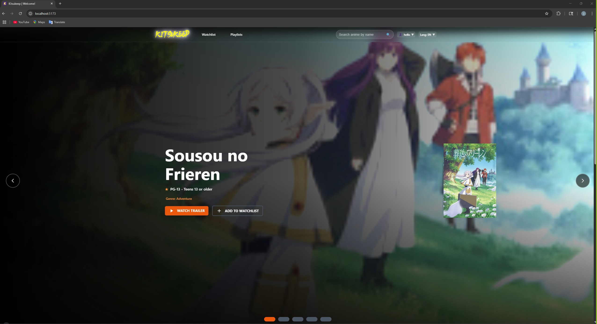
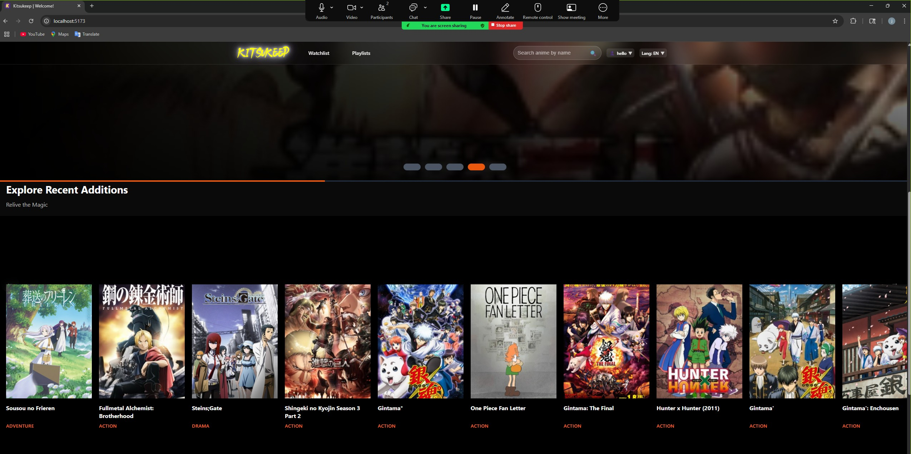
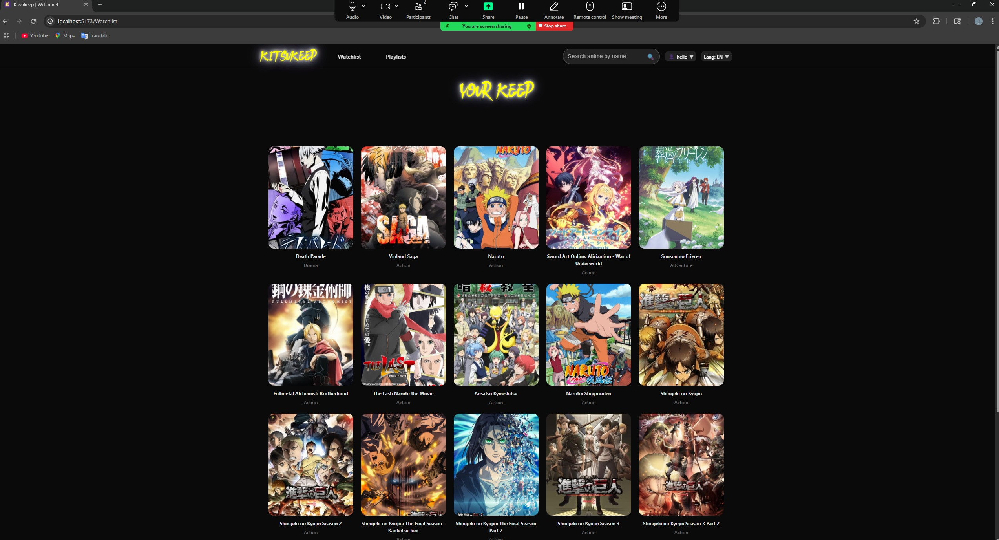
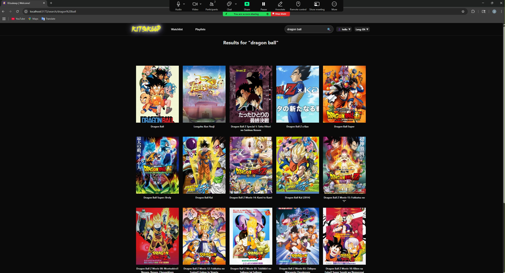
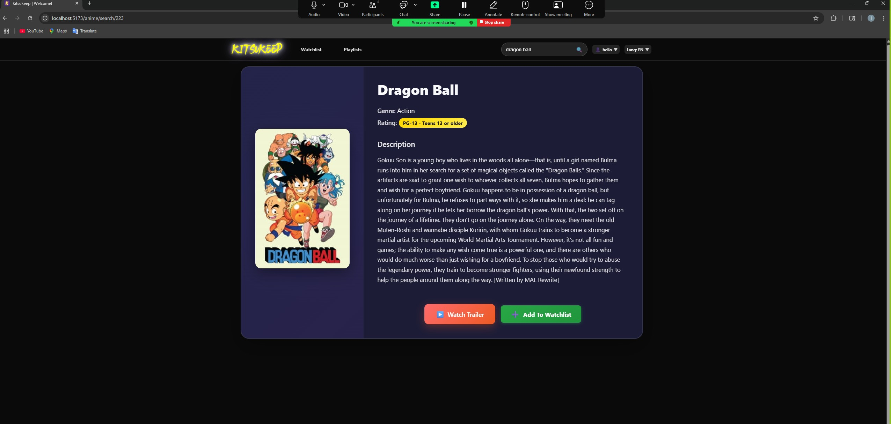
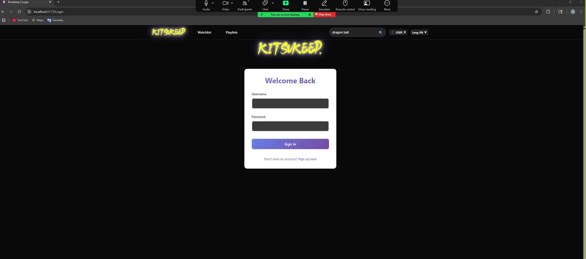
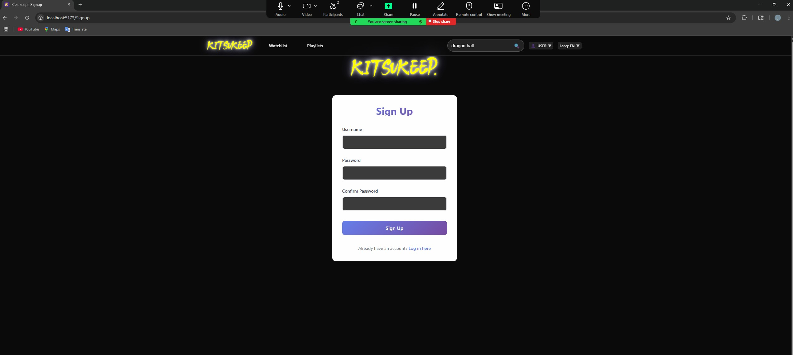
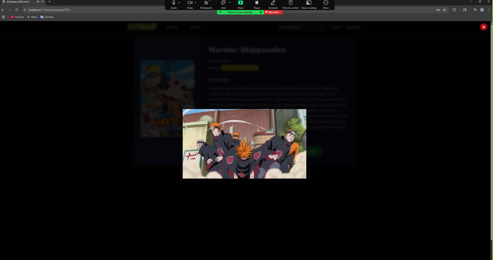

# KitsuKeep
Welcome to KitsuKeep -- Your Anime. Your Notes. Your World.

# Project Description

KitsuKeep – Your Ultimate Anime Companion

Dive into the world of anime with KitsuKeep, the all-in-one app designed for fans who love to watch, review, and stay organized. Whether you're a casual viewer or a seasoned otaku, KitsuKeep helps you track your journey with access to over   15,000 anime titles using an external api.

🔸 Discover the Best – Explore our curated homepage featuring the top 20 highest-rated anime of all time.
🔸 Build Your Watchlist – Add or remove anime from your personal watchlist and keep track of what you’re watching, finished, or planning next.
🔸 Leave Your Thoughts – Create and delete notes for any anime in your watchlist. Share impressions, rate characters, or jot down epic moments.
🔸 Search with Power – Instantly search across thousands of titles to find your next binge-worthy series.
🔸 Preview Before You Watch – Watch trailers and read detailed descriptions to decide what’s worth your time.

Whether you're keeping track of your favorite shows or discovering new ones, KitsuKeep makes your anime experience smarter, simpler, and more personal.

# User Stories

As a user,
I want to view the anime on the homepage,
So that I can easily discover what’s popular and worth watching.

As a user,
I want to add anime titles to my watchlist,
So that I can keep track of shows I’m interested in watching.

As a user,
I want to remove anime from my watchlist,
So that I can keep my list organized and relevant to my current interests.

As a user,
I want to create personal notes for anime in my watchlist,
So that I can remember my thoughts, reactions, or favorite moments.

As a user,
I want to delete notes I’ve written,
So that I can remove outdated or unwanted content from my records.

As a user,
I want to search from a vast library of over 15,000 anime titles,
So that I can quickly find shows I’m looking for or discover new ones.

As a user,
I want to watch trailers for anime,
So that I can get a preview before deciding whether to add it to my watchlist.

As a user,
I want to read detailed descriptions of each anime,
So that I can better understand the plot and decide if it matches my interests.

As a new user,
I want to create an account,
So that I can save my watchlist, notes, and preferences for future visits.

As a returning user,
I want to log in to my account,
So that I can access my personalized watchlist and notes.

As a logged-in user,
I want to log out of my account,
So that I can protect my information and ensure my activity is private on shared devices.

# Screenshots










# List of features implemented
🔝 Anime Homepage
Displays a curated list of the highest-rated anime on the homepage.

🔍 Anime Search
Search through a library of over 15,000 anime titles using keywords.

📋 Watchlist Management

Add anime to a personal watchlist

Remove anime from the watchlist

📝 Note-Taking System

Create notes for any anime in your watchlist

Delete existing notes

🎥 Trailer Viewing
Watch official trailers for anime titles before committing to watch them.

📖 Anime Descriptions
View detailed descriptions and metadata for each anime title.

🔐 User Authentication

Sign up for a new account

Log in to an existing account

Log out securely

# Tech stack

🚀 Frontend
React – Component-based UI library

JavaScript – Programming language for dynamic UI behavior

Vite – Frontend build tool and dev server

React Router – Client-side routing for single-page apps

i18next – Internationalization library for translating UI

⚙️ Backend
Python – Core language for server-side logic

FastAPI – Modern, high-performance web API framework

Requests – Simple HTTP client for API calls

ItsDangerous – Secure session and token handling

bcrypt – Secure password hashing for user auth

🗄️ Database
PostgreSQL – Relational database system

SQLAlchemy – ORM for Python and SQL abstraction

psycopg – PostgreSQL adapter for Python

# Start Up

Backend

The following instructions will install the dependencies needed for the app to function
```
in terminal change directories to the backend using
```
cd capstone/backend
```
once in the backend use this command to create a virtual environment
```
python -m venv .venv
```
now that you have the environment activate it using
```
source .venv/bin/acivate
```
now that your environment is activated run this commant do install the depencies needed
```
pip install -r requirements.txt
```
once dependencies are installed run this command to get the fastapi server running
```
fastapi dev
```
to ensure that the sever is running go to http://localhost:8000/docs#/default

# Database

The included docker-compose file will run a Postgres database server. The
following command will start the docker container and database server:
```
docker compose up -d
```
To make sure that there are no pre-existing docker files that will interrupt this project run this command before you write the command above in your terminal
```
docker kill $(docker ps -q)
docker system prune -af
```
To connect to the psql shell on the database server use this command
```
docker compose exec postgres psql -U postgres anime
```
once in anime database use this command to create tables
```
\i data/anime.sql
```
to populate the anime table run the "populate_database.py" file in the backend directory


Frontend

The following instruciton will get the frontend dependencies installed and running
```
To change into the frontend directory use this command
```
cd capstone/frontend
```
Once in the frontend directory you need to install the dependencies using...
```
npm install
```
after the installation you can start the server by using the command
```
npm run dev
```
then you can go to http://localhost:5173/ and explore anime to your fullest content


